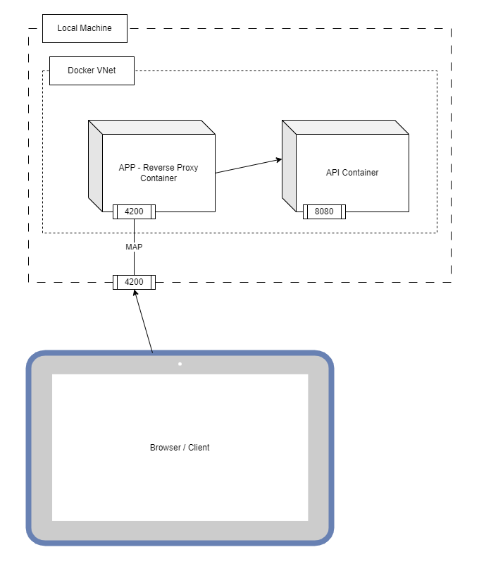

# Reverse Proxy

A Proxy is usually a machine/service that is on the border of a private network and proxy all the internet trafic from the devices connected in that natwork. It proxies all the trafic originated inside the private network.

A Reverse proxy has a similar functionality, but it proxies all the trafic originated from the internet to the inside of the network devices. It is also a machine/service that is on the border of a private network, but instead of sending trafic to the internet, it is receiving trafic from the internet and proxying it to the proper device in the private network.

## Quick start

Required:

- Java 21 (JAVA_PATH configured)
- Maven 3.5+ (Maven bin folder in PATH env var)
- Node 18+
- npm 9+

clone this repository and go to its folder

```bash
git clone git@github.com:callebedrums/reverse-proxy.git
cd reverse-proxy
```

install dependencies for the projects

```bash
cd api && ./mvnw install && cd ../ # this will move into the api folder, download dependencies and compile the project, and move back to repository folder
```

```bash
cd app && npm install && cd ../ # this will move into the api folder, download dependencies, and move back to repository folder
```

### Build API & APP

```bash
cd api && ./mvnw install && cd ../
```

```bash
cd api && npm run build && cd ../
```

## /api

The api folder contains a small spring project that implements a "Hello World" rest service application.

Required:

- Java 21 (JAVA_PATH configured)
- Maven 3.5+ (Maven bin folder in PATH env var)

### Running api project

move into the api folder `cd api`.

To execute the project, run:

```bash
./mvnw spring-boot:run
```

It will start the spring application at port 8080. You can access _http://localhost:8080/greeting_ to test it out.

### Running api in a docker container

The Dockerfile is the recipe to build a docker container image with our api application in it.

To build the docker container image we need to build our project first.

```bash
./mvnw install # it will download dependencies and compile the project
```

With the project compiled, we can now build our docker image

```bash
docker build -t reverse-proxy-api . # it will build a docker image with tag name reverse-proxy-api. this is the image tag used to start the container
```

Once we have our image built, we can instanciate a container and execute it

```bash
docker run -p 8080:8080 reverse-proxy-api # this will create a docker container using the recent built image, and map the port 8080 from the host to the port 8080 from the container
```

You can access _http://localhost:8080/greeting_ to test it out.

if you want to change the port where the service is going to list, we can do that by using a parameter

```bash
docker run -p 9000:9000 myorg/myapp --server.port=9000
```

You can access _http://localhost:9000/greeting_ to test it out.

## /app

The app folder contains an Angular application with a small Hellow World page.
It contains a form that calls the /greeting api and print the result in the page.

Required:

- Node 18+
- npm 9+

### Running app project

move into the app folder: `cd app`

install dependencies: `npm install`

start the application:

```bash
npm start
```

it will serve the application in the port 4200. You can access _http://localhost:4200_ to test the application.

It has a proxy configuration that redirects every call to the path /api to http://localhost:8080. To test the integration with the api application we have to also start the api application in the port 8080.
you can do it by running the api application using maven, or by running the docker image container created previously.

### Running app in a docker container

The Dockerfile is the recipe to build a docker container image with our app application in it.

To build the docker container image we need to build our project first.

```bash
npm build # it will bundle the code and generate the assets to be served as a static web application.
```

With the project ready, we can now build our docker image

```bash
docker build -t reverse-proxy-app . # it will build a docker image with tag name reverse-proxy-app. this is the image tag used to start the container
```

Once we have our image built, we can instanciate a container and execute it

```bash
docker run -p 4200:4200 reverse-proxy-app # this will create a docker container using the recent built image, and map the port 4200 from the host to the port 4200 from the container
```

We used nginx to serve our Angular app as a pure static application, and it will also implement the reverse proxy to the backend calls

## Reverse Proxy

the nginx server can be used as a reverse proxy, and it is being used as such for the api application.

The nginx configuration is located in the file `app/nginx/conf.d/website.conf`. and the most important configuration is the `location / ` that defines the rewrite rules for an Angular SPA

but you can also find the configuration `location /api`.

```nginx
location /api {
  rewrite ^/api/(.*)$ /$1 break;
  proxy_pass http://reverse-proxy-api:8080;
  proxy_redirect     off;
  proxy_set_header   Host $host;
}
```

it defines that every call to the path /api will be proxied to another service. in this case it will be proxied to http://reverse-proxy-api:8080.
If we call _http://localhost:4200/api/greeting_ it will first hit the nginx server that will proxy the call to _http://reverse-proxy-api:8080/greeting_.
The rewrite rule removes the prefix _/api/_ and forward the call to the url present in the configuration.

## Docker Compose

A `compose.yaml` file is provided to facilitate the execution and testing of this solution in a [docker](https://www.docker.com/) environment using [docker compose](https://docs.docker.com/compose/)

Required:

- [Docker Desktop](https://www.docker.com/products/docker-desktop/)

Before executing docker compose, make sure the api and app applications a built.

Eith Docker Desktop installed in your local machine, you can run docker compose commands to start the entire solution

```bash
docker compose up --build # CTRL + C to stop the containers
```

It will build the docker image and start them in the same network.

It will expose the nginx server to the local machine port 4200. But the api service will not be exposed.
The only way to access the api service is through the nginx reverse proxy by calling _http://localhost:4200/api_

The compose.yaml file defines two services (containers):

- the _reverse-proxy-api_ service, with the api application.
- the _reverse-proxy-app_ service, with the nginx and Angular application.

The docker compose creates a virtual network for the containers. this way, the containers are reachable from one to another, and they are named the same as the services defined in the compose.yaml file.
This way, the nginx reverse proxy can resolve the name _reverse-proxy-api_ to the container API address that holds the api application.

Docker and Docker compose is not necessary to implement the reverse proxy. We used it in this project just to facilitate the test and demonstration of the reverse proxy concept.
Nginx is also not required to implement the reverse proxy, but other web servers can be used to implement the same concept. But we recommend Nginx server for its maturity, performance, and reliability.


